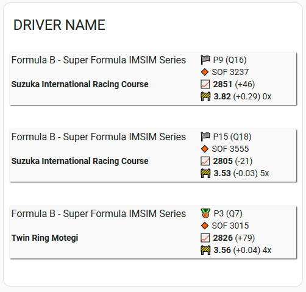

# iRacing integration for Home Assistant

## Enable Read Only Authentication in your iRacing account

Like any apps using the iRacing API, you need to activat the Read Only Authentication in your iRacing account. For more information: https://support.iracing.com/support/solutions/articles/31000173894-enabling-or-disabling-legacy-read-only-authentication

This parameter has been added in October 2024, and is disabled by default.

## Installation

### Using HACS

Add this repository to HACS, then:  
HACS > Integrations > **iRacing**

### Manual install

Copy the `iracing` folder from latest release to the `custom_components` folder in your `config` folder.

## Configuration

Go to :  
Settings > Devices & Sevices > Integrations > Add Integration, and search for "Iracing"

You can add as many drivers as you want.

For the first driver, you are required to enter:

- Your iRacing login (email address)
- Your iRacing password
- The _customer ID_ of the driver to monitor

For the subsequent drivers, you are only required to enter the _customer ID_.

## Note about iRacing credentials

The iRacing credentials are required to access the official iRacing API. Using this API is totally validated by iRacing, and it is safe to use your credentials for that.
For more information see https://forums.iracing.com/discussion/15068/general-availability-of-data-api/p1.

Your credentials are only stored locally on your Home Assistant. They are not used for anything else than API authentication. In case of doubt, you can review the source code.

## Sensors

| Sensor                               | Description                                            |
| ------------------------------------ | ------------------------------------------------------ |
| `sensor.DRIVER_NAME_driver`          | Driver name + attributes which give the 5 last results |
| `sensor.DRIVER_NAME_CATEGORY_ir`     | iRating on the category                                |
| `sensor.DRIVER_NAME_CATEGORY_sr`     | Safety rating on the category                          |
| `sensor.DRIVER_NAME_CATEGORY_laps`   | Total laps completed in the career for the category    |
| `sensor.DRIVER_NAME_CATEGORY_starts` | Total race starts in the career for the category       |
| `sensor.DRIVER_NAME_CATEGORY_wins`   | Total wins in the career for the category              |
| `sensor.DRIVER_NAME_CATEGORY_top5`   | Total top 5 finishes in the career for the category    |

The `CATEGORY` can be: `sports_car`, `formula_car`, `dirt_road`, `oval`, `dirt_oval`

## Displaying race results

You can use the [iracing-result-card](https://github.com/cazeaux/iracing-result-card).

